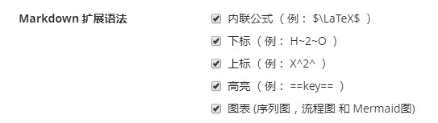
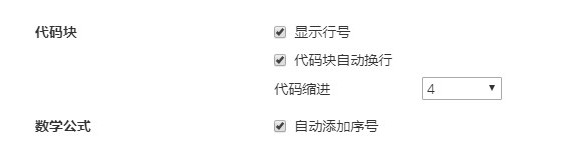
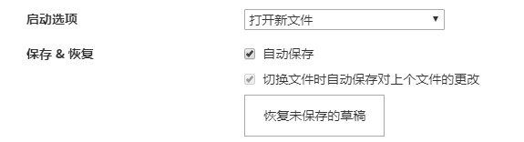

# Markdown笔记

## 0 Markdown介绍

Markdown是一种可以使用普通文本编辑器编写的标记语言，通过简单的标记语法，使普通文本具有一定的格式。

Markdown是一种轻量级标记语言，允许使用易读易写的纯文本格式编写文档。

Markdown编写的文档可以导出为HTML、Word、图像、PDF等多种格式的文档。

Markdown编写的文档后缀为.md，.markdown。

Markdown编辑器

Typora是一种流行的Markdown编辑器， 支持 MacOS 、Windows、Linux 平台，且包含多种主题，编辑后直接渲染出效果。支持导出HTML、PDF、Word、图片等多种类型文件。

新建或打开文件

直接打开typora软件即可自动进入编辑界面，可直接保存为一个Markdown文件，或者创建一个txt文件然后F2重命名修改后缀为.md。

## 1 操作规范

### 1.1 段落和换行

Enter键，即是换行或开始一个新的段落。段落只是一行或多行连续文本。在Markdown源码中段落是由两个或多个空行分隔，在typora中只需要一个空行即可。

Shift+Enter可创建单个换行符，但是有很多解析器会忽略单换行符，因此为了兼容可以在行末留下两个空格或者插入\<br/>。

Markdown段落没有特殊的格式，直接编写文字即可。

### 1.2 标题

在行开头添加1-6个#号，对应1-6个标题级别。注意#号和字符之间要留有一个空格。

```python
# 一级标题 h1
## 二级标题 h2
### 三级标题 h3
#### 四级标题 h4
##### 五级标题 h5
###### 六级标题 h6
```

typora中，输入‘# ’后跟标题内容，然后Enter可直接创建标题。其中h1和h2会有分割线。也可以不Enter，只需点击其他位置也可创建标题。

### 1.3 字体

Markdown可以使用以下几种字体：

```python
*斜体文本*
_斜体文本_
**粗体文本**
__粗体文本__
***粗斜体文本***
___粗斜体文本___
```

效果： *斜体文本*     **粗体文本**    ***粗斜体文本***

### 1.4 分割线

在一行中，用三个以上的星号、减号或下划线建立一个分割线，行内不能再有其他内容。其中星号和减号中间也可以插入空格。

```python
***
********
---
- - -
_____
```

***

### 1.5 删除线

在文字的两端分别加上两个~~，即可在文字上加删除线。

```python
~~python~~
```

效果： ~~python~~

### 1.6 下划线

下划线可以通过HTML的\<u>标签实现。

```python
<u>待加下划线的文本</u>
```

效果： <u>待加下划线的文本</u>

### 1.7 脚注

脚注是对文本的补充说明。格式如下：

```python
[^待加脚注的文本]
[^待加脚注的文本]: 脚注的内容
```

效果：[^待加脚注的文本]

[^待加脚注的文本]: 脚注的内容

注意：冒号要用英文下的。

### 1.8 列表

Markdown支持有序和无序列表。输入第一个标记之后回车会默认自动创建一行列表，只需回车两次即可退出。

#### 1.8.1 无序列表

使用星号、加号或减号作为列表标记。

```python
* 第一项
* 第二项
* 第三项

+ 第一项
+ 第二项
+ 第三项

- 第一项
- 第二项
- 第三项
```

效果：

* 第一项
* 第二项
* 第三项

+ 第一项
+ 第二项
+ 第三项

- 第一项
- 第二项
- 第三项

#### 1.8.2 有序列表

使用数字并加上小数点（.）表示：

```python
1. 第一项
2. 第二项
3. 第三项
```

效果：

1. 第一项
2. 第二项
3. 第三项

#### 1.8.3 嵌套列表

嵌套列表只需再子列表中的选项添加四个空格或Tab即可。

```python
1. 第一项
	- 第一项嵌套的第一个子项
    - 第二项嵌套的第二个子项
2. 第二项
	- 第二项嵌套的第一个子项
    - 第二项嵌套的第二个子项
```

效果：

1. 第一项
	- 第一项嵌套的第一个子项
    - 第二项嵌套的第二个子项
2. 第二项
	- 第二项嵌套的第一个子项
    - 第二项嵌套的第二个子项

#### 1.8.4 任务列表

任务列表也就是复选框。语法为（\- []：表示未完成，- [x]：表示已完成）。

但是在typora中，减号（横线）会先解析为无序列表，因此难以实现。

可以通过两种方法：

- 段落 -> 任务列表
- 右键，点击图标

插入任务列表后就可以点击进行勾选。

### 1.9 区块

#### 1.9.1 区块表示

Markdown区块引用是在段落开头使用>符号加空格。回车会自动添加区块，连续两个回车可结束添加。

```python
> 添加区块
> 再添加一个区块
```

效果：

> 添加区块
> 再添加一个区块

#### 1.9.2 区块嵌套

一个>是最外层，两个>>是第一层嵌套，以此类推。

```python
> 最外层
>> 第一层嵌套
>>> 第二层嵌套
```

效果：

> 最外层
> > 第一层嵌套
> >
> > > 第二层嵌套

#### 1.9.3 区块中使用列表

区块链中使用列表示例如下：

```
> 区块中使用列表
> 1. 第一项 
> 2. 第二项
> - 第一项
> - 第二项
> - 第三项
```

> 区块中使用列表
> 1. 第一项 
> 2. 第二项
> - 第一项
> - 第二项
> - 第三项

####  1.9.4 列表中使用区块

如果要在列表项目内放进区块，那么就需要在 > 前添加四个空格的缩进。区块中使用列表实例如下：

```
- 第一项
    > 百度网址
    > 腾讯网址
- 第二项
```

效果：

- 第一项
    > 百度网址
    > 腾讯网址
- 第二项

操作方法：输入第一行成为列表然后回车，第二行也会是列表，把小圆点先用删除，然后再输入>，即可形成缩进。

### 1.10 代码

如果是段落上的一个函数或片段，可以用反引号（` 英文输入、tab上面的那个键）将其包起来。

```
`abs()`绝对值函数
```

效果： `abs()`绝对值函数

如果是代码块，直接敲入```，然后回车，也可以指定语言（如python，可选），然后回车。

示例： \```python

快捷键：Ctrl +Shift + k

### 1.11 链接

链接的使用方法如下：

```
[链接名称](链接地址)
或者
<链接地址>
```

示例如下：

```
这是一个链接[百度链接](https://www.baidu.com)
```

效果： 这是一个链接[百度链接](https://www.baidu.com)

鼠标点一下百度链接，会出现该链接内容。

```
<www.biadu.com>
```

效果： <www.biadu.com>

高级链接

```
链接也可以用变量来代替，文档末尾附带变量地址：
这个链接用 1 作为网址变量 [Google][1]
这个链接用 baidu 作为网址变量 [Baidu][baidu]
然后在文档的结尾为变量赋值（网址）

​```[1]: http://www.google.com/
[baidu]: http://www.baidu.com/```
```

效果：

链接也可以用变量来代替，文档末尾附带变量地址：
这个链接用 1 作为网址变量 [Google][1]
这个链接用 baidu 作为网址变量 [Baidu][baidu]
然后在文档的结尾为变量赋值（网址）

```
[baidu]: http://www.baidu.com/
```

并没有实现效果。

### 1.12 图片

Markdown插入图片的语法格式如下：

```


```

* 开头一个感叹号！
* 接着一个方括号，里面放上图片的替代文字
* 接着一个普通括号，里面放上图片的网址，还可以加‘title’属性的文字，用引号包裹

typora中插入图片的快捷方法：

* 直接复制图片，在Typora界面直接Ctrl+V；

* 直接把图片拖到Typora中，Typora会自动插入；
* 右键->插入->图像，然后选择文件路径；
* 快捷键 Ctrl + Shift + i
* 以html块的形式插入，可修改属性，见2.6节

Markdown插入图片只是保留图片的原始路径（或URL），并不是直接将图片的内容插入到文档当中。因此插入图片不是很方便。因此离开了当前电脑或网络，就会无法打开图片。为了解决这一问题，有几种方法。

- 使用相对路径，需要发送到别的电脑时，连同相对路径的图片一起打包发送或转成PDF；

- 使用base64格式，嵌入到文档之中；

使用相对路径，在2.3节偏好设置当中已经提到了相关配置，配置之后在需要插入图片时，即可自动生成。优点是文档内不需要嵌入base64编码，缺点是图片在文档之外的文件夹，发送到其他电脑时需要打包一起发送。不过在仅需要查看的时候也可以直接转为PDF发送。

使用base64格式，可参考[链接](https://blog.csdn.net/qq_28304687/article/details/111480163?spm=1001.2101.3001.6650.2&utm_medium=distribute.pc_relevant.none-task-blog-2%7Edefault%7ECTRLIST%7ERate-2-111480163-blog-115793075.pc_relevant_multi_platform_whitelistv3&depth_1-utm_source=distribute.pc_relevant.none-task-blog-2%7Edefault%7ECTRLIST%7ERate-2-111480163-blog-115793075.pc_relevant_multi_platform_whitelistv3&utm_relevant_index=5)。优点是图片以base64编码嵌入文档中，比较方便，缺点是base64编码一般都比较长，放到文档中有些累赘，即使是放到文档最后。

### 1.13 表格

简单的表格，可以直接通过以下方法，选择行列数插入：

* 右键->插入->表格
* 段落->表格
* Ctrl + T

插入后也可以对表格进行增删、格式修改等；

Markdown制作表格使用|来分隔不同的单元格，使用-分隔表头和其他行。语法格式如下：

```
| 表头 | 表头 |
|------|-------|
| 单元格 | 单元格|
| 单元格 | 单元格 |
```

将上面的内容复制粘贴到文本区域，也可插入表格：

| 表头   | 表头   |
| ------ | ------ |
| 单元格 | 单元格 |
| 单元格 | 单元格 |

设置标个的对其方式：

* -:  设置内容和标题栏居右对齐
* :-  设置内容和标题栏居左对齐 
* :-:  设置内容和标题栏居中对齐

```
|表头左对齐|表头右对齐|表头居中对齐|
|:------|-----:|:-----:|
| 单元格 | 单元格| 单元格|
| 单元格 | 单元格 | 单元格|
```

效果：

| 表头左对齐 | 表头右对齐 | 表头居中对齐 |
| :--------- | ---------: | :----------: |
| 单元格     |     单元格 |    单元格    |
| 单元格     |     单元格 |    单元格    |

## 2 高级操作技巧

### 2.1 转义

Markdown使用了很多特殊符号来表示特定的意义，但是如果需要显示这些特定的符号本身，则需要转义字符。Markdown使用反斜杠（\）来转义特殊字符。

```
**文本加粗** \*\*正常显示星号\*\*
```

效果： **文本加粗** \*\*正常显示星号\*\*

Markdown支持以下符号前面加上反斜杠来进行转义，插入该符号本身。

```
\   反斜线
`   反引号
*   星号
_   下划线
{}  花括号
[]  方括号
()  小括号
#   井字号
+   加号
-   减号
.   英文句点
!   感叹号
```

### 2.2 公式

数学公式使用两个美元符号$$，包裹TeX或者LaTeX格式的数学公式来实现。提交后内会根据需要加载Mathjax对数学公式进行渲染。

* 点击段落->公式块
* 快捷键 Ctrl + Shift + m
* $$ + 回车

```
$$
\mathbf{V}_1 \times \mathbf{V}_2 =  \begin{vmatrix}
\mathbf{i} & \mathbf{j} & \mathbf{k} \\
\frac{\partial X}{\partial u} &  \frac{\partial Y}{\partial u} & 0 \\
\frac{\partial X}{\partial v} &  \frac{\partial Y}{\partial v} & 0 \\
\end{vmatrix}
$$tep1}{\style{visibility:hidden}{(x+1)(x+1)}}
$$
```

效果：
$$
\mathbf{V}_1 \times \mathbf{V}_2 =  \begin{vmatrix}
\mathbf{i} & \mathbf{j} & \mathbf{k} \\
\frac{\partial X}{\partial u} &  \frac{\partial Y}{\partial u} & 0 \\
\frac{\partial X}{\partial v} &  \frac{\partial Y}{\partial v} & 0 \\
\end{vmatrix}
$$

Typora可以使用行内公式，行内公式开启需要设置。参见2.3节内联公式设置。

### 2.3 偏好设置

文件->偏好设置

typora扩展

typora扩展Markdown语法。

高亮：两个等号包起来实现语法==高亮==；

上下标：使用~包起来实现下标，^包起来实现下标；

​              如： H~2~O    X^2^

内联公式：支持直接输入LaTeX公式，输入两个$，然后在二者之间输入公式即可；

图表：




图片插入：根据个人习惯选择图片的保存方式。

​                    复制图片到./${filename}.assets文件夹，表示会将插入的图片自动复制到被插入文档所在位置的文件       				    夹（文件夹名字以 文件名.assets 命名）。



保存&恢复：自动保存尽量选一下，确保编辑内容不丢失。

### 2.4 打字机模式和专注模式

在视图中勾选即可使用这两种模式，快捷键分别对应F8和F9。

打字机模式：使得编辑的行永远处于屏幕中间。

专注模式：使得编辑的行保留颜色，其他行的字体呈现灰色状态。如果使用滚轮将编辑行滚动到画面之外，则画面内的所有行恢复正常，便于浏览。

### 2.5 浏览器属性

Typora 是一个伪装成文本编辑器的浏览器。按下 Shift + F12 快捷键或者右键检查元素时，页面会弹出一个基于 Chrome 的开发者工具栏。

Typora 利用解析器先将我们写的 Markdown 文档解析成为 HTML 文档，再为它嵌入一个 CSS 样式，最后再加上可能需要的脚本等。

由于其本身「浏览器」的属性，可以直接在实时预览界面用 Ctrl +C 复制到 HTML 代码。一个实用的用处是将这些 HTML 代码直接 Ctrl + V 黏贴到微信公众号后台，基本可以保证两边显示效果相同。这一点不仅使公众号推送可以有更自由、美观的样式，也让编辑、排版更轻松。

### 2.6 插入html

插入html代码，输入```html回车即可。

```html
<html>
    <head>
        网页标题
    </head>
</html>
```

插入html块，输入\<center\>然后在最后回车即可；

<center>
    这里是网页 html块
</center>

通过html块插入图片，只需增加img即可，后面可以添加属性，需要熟悉HTML的代码。

```
<center>
    <
</center>
```

将图片宽高等比例缩放为原来的60%，居左对其。如果图片不存在则显示alt熟悉名称代替。

<center>
    
</center>


```python
<center>
    
</center>
```

将图片宽高设置为400像素和280像素，默认居中。

<center>
    
</center>


### 2.7 Emoji

插入emoji表情。只需要先输入一个:英文冒号，然后再输入字母的时候，软件就会根据联想来展示你可能要打出的emoji表情。

### 2.8 typora设置字体颜色大小

把要设置的字体放到font中间，输入完以后按回车即可。

<font size=2 color="green">设置字体大小为2，颜色为绿色</font>

<font size=4 color="hotpink">设置字体大小为4，颜色为热情的粉红</font>

<font size=1 color="purple">设置字体大小为6，颜色为紫色</font>

### 2.9 快捷键

常用的typora快捷键。

标题(Ctrl+1(2，3，4，5，6))

字体(Ctrl+I斜体，Ctrl+B粗体)

删除线(Alt+Shift+5)

下划线(Ctrl+U)

代码高亮(Ctrl+Shift+`)

代码段(Ctrl+Shift+K)

链接(Ctrl+K)

图片(Ctrl+C，Ctrl+V直接复制粘贴)

插入图片(Ctrl+Shift+I)

表格(Ctrl+T)

显示隐藏侧边栏(Ctrl+Shift+L)

显示大纲(Ctrl+Shift+1)

显示文档(Ctrl+Shift+2)

文档搜索(Ctrl+Shift+F)

内容搜索(Ctrl+F)

源代码模式(Ctrl+/)

插入公式（Ctrl + Shift + m）

### 2.10 LaTeX公式

LaTeX的公式输入需要掌握格式和代码，熟练才能记忆。


【参考】

1\.  https://cloud.tencent.com/developer/article/1461211