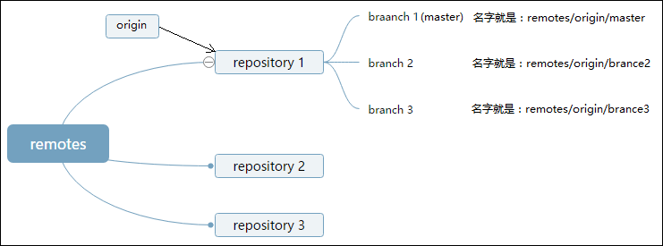

Road_of_git

分布式管理系统

主要是和GitHub相关的一些应用方法介绍，查漏补缺。


安装git

全局配置

git config --global user.name "你的名字"
git config --global user.email "你的邮箱"

删除全局配置

git config --global --unset user.name "你的名字"
git config --global --unset user.email "你的邮箱"


git config --global -l             # 查看是否取消成功，无输出即为全部取消


git 本地常用操作

git --version                          # 查看git版本

git init                                    # 初始化git，新建空项目文件夹时可以执行，会生成一个 .git文件夹；

git branch                             # 查看分支，前面带*的就是当前所在分支；

git branch -r                         # 查看远程分支

git branch -a                         # 查看所有分支

git branch abc                      # 从主分支分出为abc的分支；

git branch –d abc                # 删除abc分支，不能删除当前所在分支，需切换到其他分支再删除；

git checkout abc                  # 切换至abc分支；

git status                              # 查看当前git状态；

git log                                   # 查看commit历史，q退出；

git remote                            # 查看所有远程主机

git remote –v                       # 查看有几个远程仓库；

git remote show origin      # 查看某个远程仓库的具体信息，以origin为例

git remote add 远程仓库名  网址        # 添加远程主机

eg:  git remote add gitee https://gitee.com/xzq1392/LLM-Study.git

​       git remote add origin git@github.com:bertilchan/gitTest.git   #ssh的方式

​       git remote add gitee git@gitee.com:bertil/git-test.git 

git remote rm 主机名          # 删除远程主机

git remote rename  原主机名   新主机名        # 修改远程主机名称


github 下载提交操作

git clone [-b main] URL     # 从GitHub上下载工程到本地，URL 是工程的网址，后加.git；

git add .              # 添加修改到缓存区，点表示当前路径所有，也可指定文件和路径，有多个时列出，空格隔开；

git commit -m "modify readme"    # 添加修改的注释说明；

#git remote add origin URL   # 建立URL的origin，相当于是个别名，如果已有，则不需要执行；

#如果遇到报错fatal: 远程 origin 已经存在，执行：git remote rm origin

#git push -u origin main    # 推送到主干的main分支，也有的是master分支，注意区分；

提示输入用户名和密码，输入完成即可。

注意：空项目第一次上传需加-u参数，如果是修改文件可以不加；


删除github的文件夹或文件

GitHub只能删除仓库，却不能删除文件或文件夹，只能通过远程命令解决；

首先进入到本地仓库，如果没有就git clone；

git pull origin main   # 更新本地仓库，非必须

git rm -r --cached dir   # 删除dir文件夹

或：git rm --cached test.py  # 删除文件test.py

注：--cached参数表示缓存，只删除GitHub上的文件夹，不删除本地文件夹；

git commit -m “del target”

git remote add origin URL

git push origin main


重难点释义

1 指令中常见的origin的含义

在git中，origin的意思是指“远程仓库”，就是远程仓库链接的别名，是在clone一个托管在Github上代码库时，git默认创建的指向这个远程代码库的标签，origin指向的就是本地的代码库托管在Github上的版本。

git的远程服务器端(remote)端包含多个repository，每个repository可以理解为一个项目、仓库。

而每个repository下有多个branch（分支）。"origin"就是指向一个repository。

服务器端的"master"（强调服务器端是因为本地端也有master）就是一个branch。

这是服务器端(remote)的情况：



而在本地电脑（local）上："master"就是指向刚刚从remote server传到本地的branch。

git push A B:C

其中A是remote端的一个repository的名字（可以是仓库地址的别名、短名称、IP地址）；

C是该A这个repo中的一个branch的名字；

B是本地端一个branch的名字；

意思是把本地的B分支推送到远程电脑的A仓库的C分支。当B=C时可以直接省略为：git push A B。比如：

"git push origin master:master" 可以直接省略为"git push origin master"。

在本地的repo中，执行：

```python
git remote -v
```

可以看到：

```python
origin https://github.com/user1/repository.git(fetch)
origin https://github.com/user1/repository.git(push)
```

也就是说git默认创建了一个指向远端代码库标签，叫origin。

如果有其他用户fork了这个repo，再clone到本地，该用户执行`git remote -v`之后：

```python
origin https://github.com/user2/repository.git(fetch)
origin https://github.com/user2/repository.git(push)
```

如果该用户想添加一个远程指向源repo，可以：

```python
git remote add stream https://github.com/user1/repository.git
```

该用户执行`git remote -v`之后：

```python
origin https://github.com/user2/repository.git(fetch)
origin https://github.com/user2/repository.git(push)
stream https://github.com/user1/repository.git(push)
stream https://github.com/user1/repository.git(push)
```

增加了指向user1代码库的stream标签。


git中pull和fetch的区别是什么

Git fetch和git pull区别为：远端跟踪分支不同、拉取不同、commitID不同。

一、远端跟踪分支不同

1、Git fetch：Git fetch能够直接更改远端跟踪分支。

2、git pull：git pull无法直接对远程跟踪分支操作，我们必须先切回本地分支然后创建一个新的commit提交。

二、拉取不同

1、Git fetch：Git fetch会将数据拉取到本地仓库 - 它并不会自动合并或修改当前的工作。

2、git pull：git pull是从远程获取最新版本并merge到本地，会自动合并或修改当前的工作。

三、commitID不同

1、Git fetch：使用Git fetch更新代码，本地的库中master的commitID不变，还是等于1。

2、git pull：使用git pull更新代码，本地的库中master的commitID发生改变，变成了2。


git push origin master和git push的区别

1、git push origin master 指定远程仓库名和分支名。

2、git push 不指定远程仓库名和分支名。

3、这两者的区别：git push是git push origin master的一种简写形式

（1）当只关联一个远程，只有一个分支时，这两个命令没什么区别。

（2）当你关联了两个多个仓库、有多个分支时，git push可能会报错，因为它不知道要上传代码到哪里去；而git push origin master指定仓库和分支，就不会报错。

```python
# 比如关联两个仓库: github 和码云 
git remote add origin github-url 
git remote add gitee gitee-url 
# 分支有两个：master ，test-branch
```

如果本地分支都有关联远程仓库，而且有两个远程仓库，那么如果使用git push ，默认是使用你最近使用的那个远程仓库。

4、建议使用 git push origin master
如果你想偷懒使用git pull，那么你就要保证你的绑定的远程仓库只有一个，并且只有一个分支。

```python
# 查看远程仓库的数量（简单信息）
git remote -v 
# 查看某个远程仓库的具体信息，以origin为例：
git remote show origin 
# 查看分支信息
git branch 
```


更新同步master最新代码

git checkout master 切换到master分支
git pull 拉取最新代码
git checkout dev 切换回本地分支
git merge master 在Git中merge是用来把分叉的提交历史放回到一起的方式。git merge命令用来将你之前使用git branch命令创建的分支以及在此分支上独立开发的内容整合为一个分支。
git push 更新到分支


关于分支处理

git merge用途

git-merge 命令是用于从指定的 commit(s) 合并到当前分支的操作。

注：这里的指定 commit(s) 是指从这些历史 commit 节点开始，一直到当前分开的时候。

1、用于 git-pull 中，来整合另一代码仓库中的变化（即：git pull = git fetch + git merge）

2、用于从一个分支到另一个分支的合并


下面看下git merge用法，具体内容如下所示：

一、开发分支（dev）上的代码达到上线的标准后，要合并到 master 分支

git checkout dev

git pull

git checkout master

git merge dev

git push -u origin master(这段指令根据项目的git实际库情况使用)

二、当master代码改动了，需要更新开发分支（dev）上的代码

git checkout master

git pull

git checkout dev

git merge master

git push -u origin dev(这段指令根据项目的git实际库情况使用)


一个本地项目同时关联GitHub和gitee

参考10-13

注：

1）初始创建/提交项目，已存在二者之一的项目，clone到本地，在另一个上建议新建空项目，否则需要pull和merge，比较麻烦，或者gitee上新建时直接从GitHub上导入。二者都不存在的全新项目，可以在二者上新建空项目，然后push。

2）关联后第一次commit时，仍需要设置用户名和邮箱，如果GitHub和gitee用户名和邮箱不同，设置任意一个即可，实际push时仍是各自的账号。

3）ssh-add添加rsa识别时，可通过ssh-add -l查看添加后的结果。

4）设置远程仓库名时优先选择ssh，可以避免每次push时输入账号和密码。


删除fork的项目，点击setting，下拉到最后，找到delete this repo，输入项目名称，即可删除

 

gnutls_handshake() failed: The TLS connection was non-properly terminated.

方法一：执行

git config --global  --unset https.https://github.com.proxy

git config --global  --unset http.https://github.com.proxy

方法二：

采用ssh的方式设置远程仓库名，参考git remote add xxx命令的用法。好像是可以，反正设置后试着推送几次都正常。

 

提交pr：

Fork到自己的仓库  # 注意分支，有个勾选，会只fork一个分支，可以取消勾选；

git clone到本地   # 注意分支

创建新分支，并修改文件

上传到自己的仓库中，在创建的分支；

打开远程仓库就会自动看见pr提示或者自己create也行。。

可能需要建立本地和fork源项目的联系。通过git remote -v查看。

git remote add upstream https://github.com/PaddlePaddle/PaddleDetection.git


更新同步fork的项目

在fork的项目有个sync fork


【参考】

1 https://xiaopengzhen.blog.csdn.net/article/details/109338610?spm=1001.2101.3001.6650.4&utm_medium=distribute.pc_relevant.none-task-blog-2%7Edefault%7EBlogCommendFromBaidu%7ERate-4-109338610-blog-89743120.235%5Ev38%5Epc_relevant_sort&depth_1-utm_source=distribute.pc_relevant.none-task-blog-2%7Edefault%7EBlogCommendFromBaidu%7ERate-4-109338610-blog-89743120.235%5Ev38%5Epc_relevant_sort&utm_relevant_index=5

2 https://www.php.cn/faq/487235.html

3 https://www.php.cn/faq/487230.html

4 https://github.com/firstcontributions/first-contributions

5 https://blog.csdn.net/weixin_41287260/article/details/89743120

6 https://blog.csdn.net/wt_better/article/details/107002289

7 https://blog.csdn.net/wojsg001/article/details/126300652?utm_medium=distribute.pc_relevant.none-task-blog-2~default~baidujs_baidulandingword~default-0-126300652-blog-125083107.235^v38^pc_relevant_sort&spm=1001.2101.3001.4242.1&utm_relevant_index=3

8 https://blog.csdn.net/qq_33429968/article/details/62219783

9 https://www.cnblogs.com/xiaopangjr/p/7469687.html

10 https://www.jianshu.com/p/68578d52470c

11 https://blog.csdn.net/Bertil/article/details/119464439

12 https://blog.csdn.net/xiecheng1995/article/details/106570059

13 https://blog.csdn.net/yilovexing/article/details/107226141


