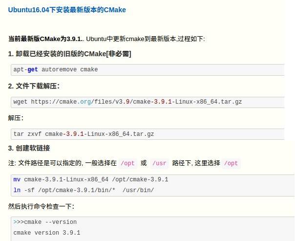

Road_of_ubuntu

### linux命令

解压tar

tar -zxvf xxxx.tar.gz

tar -xvJf  xxxx.tar.xz    # .xz结尾是打包后再压缩的文件，外面是xz压缩方式，里面是tar打包方式；

等价于：xz -d xxx.tar.xz    tar -xvf xxx.tar


### 代理相关

安装软件tinyproxy：sudo apt-get install tinyproxy

打开：/etc/tinyproxy.conf 或 /etc/tinyproxy/tinyproxy.conf 

修改：

Port 8888                          # 预设是8888 Port,你可以更改

Allow 127.0.0.1                # 将127.0.0.1改成你自己的IP

​                                           # 例如你的IP 是1.2.3.4,你改成Allow 1.2.3.4,那只有你才可以连上这个Proxy

​                                          # 若你想任何IP都可以连到Proxy在Allow前面打#注释

启动：sudo service tinyproxy start

参考： https://blog.csdn.net/qq_27047075/article/details/104164043


使用代理

vi ~/.bashrc

添加：

export http_proxy="http://192.168.0.1:8888"
export https_proxy="http://192.168.0.1:8888"

将192.168.0.1改成设置代码的服务器，8888改成设置的端口；

source ~/.bashrc

支持Windows软件开启ie代理、http。


### nccl安装

sudo apt install libnccl2=2.11.4-1+cuda10.2 libnccl-dev=2.11.4-1+cuda10.2

环境问题：

ModuleNotFoundError: No module named ‘MultiScaleDeformableAttention‘

问题原因：有些代码需要单独的库文件。提示缺少库文件，该库不是Python的库，而是需要自己编译的一个库。

可以查看原始代码的readme文件里面的安装教程。以DINO为例，需要编译。

```python
cd ./models/dino/ops
python setup.py build install
```


### 低版本gcc安装

gcc-4

在/etc/apt/sources.list中加入两行。

```python
deb http://dk.archive.ubuntu.com/ubuntu/ xenial main
deb http://dk.archive.ubuntu.com/ubuntu/ xenial universe
```

然后sudo apt update。

```python
sudo apt-get install gcc-4.7 gcc-4.7-multilib g++-4.7 g++-4.7-multilib
```

【参考】https://blog.csdn.net/broliao/article/details/104613443

gcc-5/7/9

【参考】https://blog.csdn.net/wowbing2/article/details/117962272

查看gcc

dpkg -l | grep gcc

which gcc

配置切换gcc版本。

查看软连接：sudo update-alternatives --config gcc

如果提示：update-alternatives: error: no alternatives for gcc

【参考】https://blog.csdn.net/krokodil98/article/details/113394752

https://blog.csdn.net/uniqueyyc/article/details/85407693

### Cmake




### CUDA相关

#### 1 安装

chmod 777 cuda_11.7.0_515.43.04_linux.run    # 修改权限

./cuda_11.7.0_515.43.04_linux.run                # 安装命令

若提示：Existing package manager installation of the driver found. It is strongly recommended that you remove this before continuing

按向下箭头，选择continue然后回车即可；

提示：Do you accept the above EULA？

输入：accept，再回车；

进入CUDA Installer界面。

光标移动到Driver行，回车，即可将[X]中的X去掉，表示不选择，不安装驱动，因为驱动提前已经装过了；

CUDA Demo Suite 11.7和CUDA Documentation 11.7，这两项可选，文档和demo一般没啥用，可以回车去掉X，当然安装也行；

如果不需要改变安装位置等细节，直接向下移动光标到Install，回车安装即可；

如果需要修改则移动到Options，回车，进入Options界面；

Driver Options：无需操作；

Library install path (Blank for system default)：无需操作；

移动光标到Tookit Options然后回车，进入CUDA Toolkit界面；

Change Toolkit Install Path：回车后即可修改安装位置；

Create symbolic link from /usr/local/cuda： 是否建立软连接到系统cuda位置，默认是创建的。但是如果是多cuda共存，就不要建立。回车把X去掉；

Create desktop menu shortcuts：在No的行回车，选择No，不创建桌面快捷方式；

Install manpage documents to /usr/share/man：是否安装用户手册，可以去掉X不安装，可选；

然后移动到Done，退出当前界面，回到上一级；

再移动到Done退出Options界面，回到CUDA Installer界面，再移动到Install回车即可安装；

安装完成后提示如下：

Driver:   Not Selected
Toolkit:  Installed in /path/to/cuda-11.7/

Please make sure that
 -   PATH includes /path/to/cuda-11.7/bin
 -   LD_LIBRARY_PATH includes /path/to/cuda-11.7/lib64, or, add /path/to/cuda-11.7/lib64 to /etc/ld.so.conf and run ldconfig as root

To uninstall the CUDA Toolkit, run cuda-uninstaller in /path/to/cuda-11.7/bin
***WARNING: Incomplete installation! This installation did not install the CUDA Driver. A driver of version at least 515.00 is required for CUDA 11.7 functionality to work.
To install the driver using this installer, run the following command, replacing <CudaInstaller> with the name of this run file:
    sudo <CudaInstaller>.run --silent --driver

提示说明：

Driver：Not Selected，没问题，本来就没选，驱动是提前自己装的；

提示将bin和lib64的路径添加到环境变量，需要添加；

提示卸载方法：run cuda-uninstaller in /path/to/cuda-11.7/bin

WARNING还在提示如何安装驱动，忽略即可；

添加环境变量：

vim ~/.bashrc，在最后添加：

```python
export LD_LIBRARY_PATH=/path/to/cuda-11.7/lib64:$LD_LIBRARY_PATH
export PATH=/path/to/cuda-11.7/bin:$PATH
```

保存退出后激活一下，source ~/.bashrc

然后执行nvcc -V，可以看到相关信息的输出。如果提示Command 'nvcc' not found，那就麻烦了。说明哪一步有错误，但是一般不会，有错的话上面的步骤不会完整执行下去，会提前报错了。

#### 2 安装cuda指定位置

sudo sh ./cuda_10.2.89_440.33.01_linux.run --toolkitpath=/path/to/cuda/cuda-10.2/ --toolkit --silent

#### 3 安装cudnn

老版本cudnn下载。

https://developer.nvidia.cn/rdp/cudnn-archive

下载后解压缩，假设名字为cudnn_path。

sudo cp cudnn_path/lib64/*  /path/to/cuda-10.2/lib64
sudo cp cudnn_path/include/cudnn.h  /path/to/cuda-10.2/include

其实就是将cudnn解压出来的文件，拷贝到cuda安装的路径里面；

如果没改过cuda的安装路径，默认是/usr/local/cuda或者/usr/local/cuda-xx，xx表示版本号；

cudnn8.6等高版本，不是lib64，而是lib，根据版本情况区分即可；

参考：https://blog.csdn.net/kxqt233/article/details/113825524

#### 3 cuda卸载

卸载的实现方法
那么如何正确、完全的卸载cuda呢？

其实cuda安装时就已经准备好了卸载的接口，卸载程序在/usr/local/cuda-xx.x/bin下，需要注意的是cuda10.0及之前的版本卸载程序名为uninstall_cuda_xx.x.pl，而cuda10.1及之后的版本卸载程序名为cuda-uninstaller。
找到之后运行卸载程序即可，这里的xx.x表示自己的cuda版本。
在命令行中卸载
注意把下边的xx.x替换为自己的cuda版本。
cuda10.0及以下的卸载：

```python
cd /usr/local/cuda-xx.x/bin/
sudo ./uninstall_cuda_xx.x.pl
sudo rm -rf /usr/local/cuda-xx.x
```

cuda10.1及以上的卸载：

```python
cd /usr/local/cuda-xx.x/bin/
sudo ./cuda-uninstaller
sudo rm -rf /usr/local/cuda-xx.x
```

最后边加了一句sudo rm -rf /usr/local/cuda-xx.x，这是因为一般情况下cuda都配置了cudnn，在运行卸载程序时只会卸载cuda而不会一并删除cudnn的文件。因为cudnn文件还在的缘故，自己的cuda-xx.x文件夹仍然在，需要手动删除。
所以如果自己要卸载的cuda没有配置cudnn，那么cuda-xx.x文件夹在卸载完成后会被自动删除，也就没必要再运行最后一句了。
【参考】https://blog.csdn.net/weixin_44711603/article/details/110233047

#### 3 常见报错

错误： fatal error: cuda_runtime.h: 没有那个文件或目录

打开环境变量文件：vim ~/.bashrc

在最后添加：export CPATH=/usr/local/cuda/targets/x86_64-linux/include:$CPATH

然后激活一下：source ~/.bashrc

其中/usr/local/cuda为系统安装的cuda的路径，如果不一样需要自行替换；

备注：export LD_LIBRARY_PATH=/usr/local/cuda-10.1/targets/x86_64-linux/lib:$LD_LIBRARY_PATH，这条命令应该是不需要的。

【参考】https://blog.csdn.net/weixin_45617478/article/details/116209903


错误：/bin/sh: 1:/bin/nvcc: not found

查看nvcc是否存在，不存在需要安装cuda。

which nvcc

whereis nvcc

nvcc -V

打开环境变量文件：vim ~/.bashrc

在最后添加：export CUDA_HOME=/usr/local/cuda

然后激活一下：source ~/.bashrc

其中/usr/local/cuda为系统安装的cuda的路径，如果不一样需要自行替换；

注意：CUDA_HOME比较特殊，不带$CUDA_HOME。

cuda相关的完整的环境变量：

```python
export CPATH=/usr/local/cuda/targets/x86_64-linux/include:$CPATH
export LD_LIBRARY_PATH=/usr/local/cuda/lib64:$LD_LIBRARY_PATH
export CUDA_HOME=/usr/local/cuda
export PATH=/usr/local/cuda/bin:$PATH
```

【参考】https://blog.csdn.net/weixin_44153180/article/details/131061325?spm=1001.2101.3001.6650.4&utm_medium=distribute.pc_relevant.none-task-blog-2%7Edefault%7EBlogCommendFromBaidu%7ERate-4-131061325-blog-132598503.235%5Ev38%5Epc_relevant_sort&depth_1-utm_source=distribute.pc_relevant.none-task-blog-2%7Edefault%7EBlogCommendFromBaidu%7ERate-4-131061325-blog-132598503.235%5Ev38%5Epc_relevant_sort&utm_relevant_index=5

https://blog.csdn.net/BetrayFree/article/details/132598503?spm=1001.2101.3001.6650.3&utm_medium=distribute.pc_relevant.none-task-blog-2%7Edefault%7EYuanLiJiHua%7EPosition-3-132598503-blog-100019901.235%5Ev38%5Epc_relevant_sort&depth_1-utm_source=distribute.pc_relevant.none-task-blog-2%7Edefault%7EYuanLiJiHua%7EPosition-3-132598503-blog-100019901.235%5Ev38%5Epc_relevant_sort&utm_relevant_index=6


### TensorRT安装

官网下载，需要登录。注意查看与cuda和cudnn的匹配关系。

尽量下tar压缩包。

参考：

https://blog.csdn.net/weixin_43605641/article/details/126744446

https://blog.csdn.net/qq_37541097/article/details/114847600

https://blog.csdn.net/IAMoldpan/article/details/117908232


### conda相关

#### 1 安装

在Miniconda官方网站上查询并下载最新版本的miniconda3：Miniconda3-latest-Linux-x86_64.sh

修改权限：chmod 777 Miniconda3-latest-Linux-x86_64.sh

注意：如果是ubuntu多用户使用，需要切换到root用户下安装，如果只是自己使用，则可以在自己账户下安装。

安装执行：./Miniconda3-latest-Linux-x86_64.sh

提示1：Welcome to Miniconda3 py38_4.9.2，Please，press ENTER to continue等；

直接按回车键即可。然后出现很多license，连续按空格或回车键，向下翻页。

提示2：Do you accept the license terms? (yes | no)

输入yes，然后回车。

提示3：Miniconda3 will now be installed into this location: /home/root/miniconda3

​                 \- Press ENTER to confirm the location

​                 \- Press CTRL-C to abort the installation

​                 \- Or specify a different location below

​             [/path/to/miniconda3] >>>

此处是提示安装位置，默认是用户名下，可以直接回车即可，如果想更改，可以在>>>之后，直接输入新的路径再回车；

提示4：Do you wish the installer to initialize Miniconda3 yb running conda init? [yes | no]

此处安装程序会提示进行miniconda的初始化。

如果填yes，则此后每次启动terminal时，conda均可生效自动进入conda环境（推荐）。

如果不需要初始化则填no，此后需要使用conda时，需要自行启动conda。

如果安装时选择了yes，那么之后也可以使用以下命令取消。

conda config --set auto_activate_base false

#### 2 自行启动方法

进入安装位置，cd 到miniconda3文件夹的bin目录中，可以看到一个activate文件；

cd miniconda3/bin/

修改activate的权限：chmod 777 activate

启动：source ./activate 或者 . ./activate 或者 . path/to/activate，采用相对路径；

可以看到命令行前面出现了（base）字样，就说明已经进入了conda环境中了。

#### 3 手动改自动

打开~/.bashrc，在最后添加如下内容，保存退出后再source ~/.bashrc即可；

```python
# >>> conda initialize >>>
# !! Contents within this block are managed by 'conda init' !!
__conda_setup="$('/path/miniconda3/bin/conda' 'shell.bash' 'hook' 2> /dev/null)"
if [ $? -eq 0 ]; then
    eval "$__conda_setup"
else
    if [ -f "/path/miniconda3/etc/profile.d/conda.sh" ]; then
        . "/path/miniconda3/etc/profile.d/conda.sh"
    else
        export PATH="/path/miniconda3/bin:$PATH"
    fi
fi
unset __conda_setup
# <<< conda initialize <<<
```

注意：将path/tominiconda，改为自己安装的位置；

#### 4 更改国内源

搜一下，网上很多；

打开vim ~/.condarc，

填入：

```python
channels:

  - defaults

show_channel_urls: true

default_channels:

  - https://mirrors.bfsu.edu.cn/anaconda/pkgs/main

  - https://mirrors.bfsu.edu.cn/anaconda/pkgs/free

  - https://mirrors.bfsu.edu.cn/anaconda/pkgs/r

  - https://mirrors.bfsu.edu.cn/anaconda/pkgs/pro

  - https://mirrors.bfsu.edu.cn/anaconda/pkgs/msys2

custom_channels:

  conda-forge: https://mirrors.bfsu.edu.cn/anaconda/cloud

  msys2: https://mirrors.bfsu.edu.cn/anaconda/cloud

  bioconda: https://mirrors.bfsu.edu.cn/anaconda/cloud

  menpo: https://mirrors.bfsu.edu.cn/anaconda/cloud

  pytorch: https://mirrors.bfsu.edu.cn/anaconda/cloud

  simpleitk: https://mirrors.bfsu.edu.cn/anaconda/cloud
```

```python
channels:
  - defaults
show_channel_urls: true
default_channels:
  - https://mirrors.tuna.tsinghua.edu.cn/anaconda/pkgs/main
  - https://mirrors.tuna.tsinghua.edu.cn/anaconda/pkgs/r
  - https://mirrors.tuna.tsinghua.edu.cn/anaconda/pkgs/msys2
custom_channels:
  conda-forge: https://mirrors.tuna.tsinghua.edu.cn/anaconda/cloud
  msys2: https://mirrors.tuna.tsinghua.edu.cn/anaconda/cloud
  bioconda: https://mirrors.tuna.tsinghua.edu.cn/anaconda/cloud
  menpo: https://mirrors.tuna.tsinghua.edu.cn/anaconda/cloud
  pytorch: https://mirrors.tuna.tsinghua.edu.cn/anaconda/cloud
  pytorch-lts: https://mirrors.tuna.tsinghua.edu.cn/anaconda/cloud
  simpleitk: https://mirrors.tuna.tsinghua.edu.cn/anaconda/cloud
```

国内常用源：

```python
清华：https://mirrors.tuna.tsinghua.edu.cn/simple
阿里云：http://mirrors.aliyun.com/pypi/simple/
中国科技大学: https://pypi.mirrors.ustc.edu.cn/simple/
豆瓣：http://pypi.douban.com/simple/
```


#### 5 创建虚拟环境

conda create –n env_name python=3.7   # 创建名字为env_name的环境且指定python版本为3.7（可不指定python版本，可能默认是base的版本）；

conda create –n env_name --offline   # 离线创建环境，不指定版本

conda create –n env_name --clone base  # 复制base环境，创建新环境（离线断网时比较方便）；

conda remove –n env_name --all    删除虚拟环境

激活/切换环境：

conda activate env_name

退出环境：

conda deactivate

查看已有的环境：

conda info –e 或 conda env list

所列的环境中，最前面有个*的，表示当前所在的环境；

查看当前环境安装的包：

pip list  或者 conda list

获取版本号：conda --version 或 conda –V

安装whl包：

pip install pkg_name==xxx –i https:xxxxx    # 在线安装

和其他环境安装一样，==是指定版本，默认最新版，-i 参数指定源，可不指定；

pip install pkg_name   # 离线安装下载好的包；

添加conda环境路径：conda config --append envs_dirs /home/xzq/conda_env/     # --remove  即可删除

创建环境时通过python=3.xx，修改了默认的python版本后，进入环境可能发现python版本仍是默认版本，可以通过连续执行conda deactivate，完全退出所有环境（包括base），然后执行source path/to/miniconda3/bin/activate，激活环境，再进入试试；

#### 6 迁移虚拟环境

1）将源环境拷贝到新服务器的任意位置

源虚拟环境：path/miniconda3/envs/ori_name

2）在目标服务器上：

conda create -n new_name --clone 拷贝环境存放的路径

用个人账户会建立在~/.conda/envs路径下，与系统conda环境不冲突。

用root账户，才会上建立到本机conda的目录内，所有用户共享。

【参考】https://blog.csdn.net/qq_41967982/article/details/115867230

https://blog.csdn.net/sunmenmian/article/details/120954958

在任意位置创建新环境。

将已有环境env1克隆到env2，并指定env2的路径/home/root/env2

conda create -p /home/root/env2 --clone env1

【参考】https://blog.csdn.net/zhouhy0903/article/details/127621869

如果新建的环境变量没有名字，如通过-p指定路径的环境，可以删除。

conda remove -p /home/root/env2 --all

用名字的删除方法：

conda remove -n your_env_name --all

conda env remove --name your_env_name

#### 7 mpi4py報錯

ERROR: Could not build wheels for mpi4py, which is required to install pyproject.toml-based projects

pip安装报错，可以尝试conda，解决方案：

conda install mpi4py

下面这个方案试了，无效；

sudo apt update
sudo apt-get install libopenmpi-dev


### 各种源地址

https://mirrors.aliyun.com/pypi/simple/

https://pypi.tuna.tsinghua.edu.cn/simple/

https://mirror.baidu.com/pypi/simple

https://mirrors.cloud.tencent.com/pypi/simple

pip install xxx -i Դ

https://paddlepaddle.org.cn/whl/mkl/stable.html
https://www.paddlepaddle.org.cn/whl/linux/mkl/avx/stable.html

torch、torchvision：https://download.pytorch.org/whl/torch_stable.html

mmcv:

https://github.com/open-mmlab/mmcv/issues/1818

https://download.openmmlab.com/mmcv/dist/cu92/torch1.7.0/index.html

替换cu92、torch1.7.0，可以对应下载版本；


### 系统库报错

解决libstdc++.so.6: version `GLIBCXX_3.4.22' not found

虚拟环境中安装库时报错，可先找找对应的库，看看版本是否包含；
strings path/anaconda3/envs/tensorflow/lib/libstdc++.so.6 |grep GLIBCXX  

下载一个  http://ftp.de.debian.org/debian/pool/main/g/
或者取其他服务器拷贝一个
/usr/lib/x86_64-linux-gnu/libstdc++.so.6.0.25   先找一下对应的版本；

cp libstdc++.so.6.0.25  path/anaconda3/envs/tensorflow/lib/

cd ~/anaconda3/envs/tensorflow/lib/

rm libstdc++.so.6

ln libstdc++.so.6.0.25 libstdc++.so.6